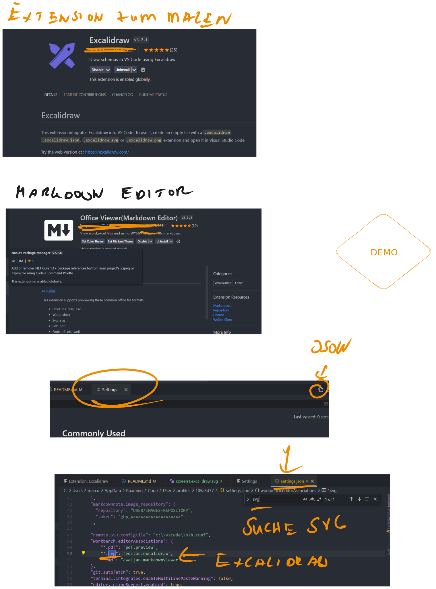

# Mein-Github-Workflow

beschreibt wie ich meine Video Dokumentation in Github erstelle

# Setup

# Beschreibung neu laden nach Änderung des Bildes

Einen Weg habe ich schon einmal gefunden - CTRL-UMSCHALTTASTE-P- RELOAD-ENTER
